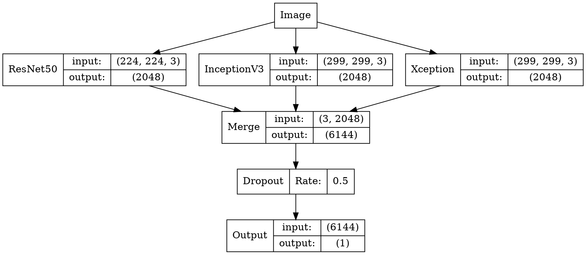

本文会通过 Keras 搭建一个深度卷积神经网络来识别一张图片是猫还是狗，在验证集上的准确率可以达到99.6%，建议使用显卡来运行该项目。本项目使用的 Keras 版本是1.2.2。如果你使用的是更高级的版本，可能会稍有参数变化。

# 猫狗大战

数据集来自 kaggle 上的一个竞赛：[Dogs vs. Cats](https://www.kaggle.com/c/dogs-vs-cats-redux-kernels-edition)，训练集有25000张，猫狗各占一半。测试集12500张，没有标定是猫还是狗。

```
➜  猫狗大战 ls train | head
cat.0.jpg
cat.1.jpg
cat.10.jpg
cat.100.jpg
cat.1000.jpg
cat.10000.jpg
cat.10001.jpg
cat.10002.jpg
cat.10003.jpg
cat.10004.jpg
➜  猫狗大战 ls test | head
1.jpg
10.jpg
100.jpg
1000.jpg
10000.jpg
10001.jpg
10002.jpg
10003.jpg
10004.jpg
10005.jpg
```

下面是训练集的一部分例子：


# 数据预处理

由于我们的数据集的文件名是以`type.num.jpg`这样的方式命名的，比如`cat.0.jpg`，但是使用 Keras 的 ImageDataGenerator 需要将不同种类的图片分在不同的文件夹中，因此我们需要对数据集进行预处理。这里我们采取的思路是创建符号链接(symbol link)，这样的好处是不用复制一遍图片，占用不必要的空间。

```py
import os
import shutil

train_filenames = os.listdir('train')
train_cat = filter(lambda x:x[:3] == 'cat', train_filenames)
train_dog = filter(lambda x:x[:3] == 'dog', train_filenames)

def rmrf_mkdir(dirname):
    if os.path.exists(dirname):
        shutil.rmtree(dirname)
    os.mkdir(dirname)

rmrf_mkdir('train2')
os.mkdir('train2/cat')
os.mkdir('train2/dog')

rmrf_mkdir('test2')
os.symlink('../test/', 'test2/test')

for filename in train_cat:
    os.symlink('../../train/'+filename, 'train2/cat/'+filename)

for filename in train_dog:
    os.symlink('../../train/'+filename, 'train2/dog/'+filename)
```

我们可以从下面看到文件夹的结构，train2里面有两个文件夹，分别是猫和狗，每个文件夹里是12500张图。

```
├── test [12500 images]
├── test.zip
├── test2
│   └── test -> ../test/
├── train [25000 images]
├── train.zip
└── train2
    ├── cat [12500 images]
    └── dog [12500 images]
```

# 导出特征向量

对于这个题目来说，使用预训练的网络是最好不过的了，经过前期的测试，我们测试了 ResNet50 等不同的网络，但是排名都不高，现在看来只有一两百名的样子，所以我们需要提高我们的模型表现。那么一种有效的方法是综合各个不同的模型，从而得到不错的效果，兼听则明。如果是直接在一个巨大的网络后面加我们的全连接，那么训练10代就需要跑十次巨大的网络，而且我们的卷积层都是不可训练的，那么这个计算就是浪费的。所以我们可以将多个不同的网络输出的特征向量先保存下来，以便后续的训练，这样做的好处是我们一旦保存了特征向量，即使是在普通笔记本上也能轻松训练。

```py
from keras.models import *
from keras.layers import *
from keras.applications import *
from keras.preprocessing.image import *

import h5py

def write_gap(MODEL, image_size, lambda_func=None):
    width = image_size[0]
    height = image_size[1]
    input_tensor = Input((height, width, 3))
    x = input_tensor
    if lambda_func:
        x = Lambda(lambda_func)(x)
    
    base_model = MODEL(input_tensor=x, weights='imagenet', include_top=False)
    model = Model(base_model.input, GlobalAveragePooling2D()(base_model.output))

    gen = ImageDataGenerator()
    train_generator = gen.flow_from_directory("train2", image_size, shuffle=False, 
                                              batch_size=16)
    test_generator = gen.flow_from_directory("test2", image_size, shuffle=False, 
                                             batch_size=16, class_mode=None)

    train = model.predict_generator(train_generator, train_generator.nb_sample)
    test = model.predict_generator(test_generator, test_generator.nb_sample)
    with h5py.File("gap_%s.h5"%MODEL.func_name) as h:
        h.create_dataset("train", data=train)
        h.create_dataset("test", data=test)
        h.create_dataset("label", data=train_generator.classes)

write_gap(ResNet50, (224, 224))
write_gap(InceptionV3, (299, 299), inception_v3.preprocess_input)
write_gap(Xception, (299, 299), xception.preprocess_input)

```

为了复用代码，我觉得写一个函数是非常有必要的，那么我们的函数就需要输入模型，输入图片的大小，以及[预处理函数](https://github.com/fchollet/keras/blob/master/keras/applications/inception_v3.py#L389-L393)，因为 Xception 和 Inception V3 都需要将数据限定在 `(-1, 1)` 的范围内，然后我们利用 `GlobalAveragePooling2D` 将卷积层输出的每个激活图直接求平均值，不然输出的文件会非常大，且容易过拟合。然后我们定义了两个 generator，利用 `model.predict_generator` 函数来导出特征向量，最后我们选择了 ResNet50, Xception, Inception V3 这三个模型（如果有兴趣也可以导出 VGG 的特征向量）。每个模型导出的时间都挺长的，在 aws p2.xlarge 上大概需要用**十分钟到二十分钟**。 这三个模型都是在 [ImageNet](http://www.image-net.org/) 上面预训练过的，所以每一个模型都可以说是身经百战，通过这三个老司机导出的特征向量，可以高度概括一张图片有哪些内容。

最后导出的 h5 文件包括三个 numpy 数组：

* train (25000, 2048)
* test (12500, 2048)
* label (25000,)

参考资料：

* [ResNet](https://arxiv.org/abs/1512.03385) 15.12
* [Inception v3](https://arxiv.org/abs/1512.00567) 15.12
* [Xception](https://arxiv.org/abs/1610.02357) 16.10

# 载入特征向量

经过上面的代码以后，我们获得了三个特征向量文件，分别是：

* gap_ResNet50.h5
* gap_InceptionV3.h5
* gap_Xception.h5

我们需要载入这些特征向量，并且将它们合成一条特征向量，然后记得把 X 和 y 打乱，不然之后我们设置`validation_split`的时候会出问题。这里设置了 numpy 的随机数种子为2017，这样可以确保每个人跑这个代码，输出都能是一样的结果。

```py
import h5py
import numpy as np
from sklearn.utils import shuffle
np.random.seed(2017)

X_train = []
X_test = []

for filename in ["gap_ResNet50.h5", "gap_Xception.h5", "gap_InceptionV3.h5"]:
    with h5py.File(filename, 'r') as h:
        X_train.append(np.array(h['train']))
        X_test.append(np.array(h['test']))
        y_train = np.array(h['label'])

X_train = np.concatenate(X_train, axis=1)
X_test = np.concatenate(X_test, axis=1)

X_train, y_train = shuffle(X_train, y_train)
```

# 构建模型

模型的构建很简单，直接 dropout 然后分类就好了。

```py
from keras.models import *
from keras.layers import *

np.random.seed(2017)

input_tensor = Input(X_train.shape[1:])
x = Dropout(0.5)(input_tensor)
x = Dense(1, activation='sigmoid')(x)
model = Model(input_tensor, x)

model.compile(optimizer='adadelta',
              loss='binary_crossentropy',
              metrics=['accuracy'])
```

我们还可以对模型进行可视化：




# 训练模型

模型构件好了以后，我们就可以进行训练了，这里我们设置验证集大小为 20% ，也就是说训练集是20000张图，验证集是5000张图。

```py
model.fit(X_train, y_train, batch_size=128, nb_epoch=8, validation_split=0.2)
```

```
Train on 20000 samples, validate on 5000 samples
Epoch 1/8
20000/20000 [==============================] - 1s - loss: 0.1193 - acc: 0.9591 - val_loss: 0.0283 - val_acc: 0.9936
Epoch 2/8
20000/20000 [==============================] - 0s - loss: 0.0319 - acc: 0.9898 - val_loss: 0.0181 - val_acc: 0.9952
Epoch 3/8
20000/20000 [==============================] - 0s - loss: 0.0252 - acc: 0.9916 - val_loss: 0.0172 - val_acc: 0.9934
Epoch 4/8
20000/20000 [==============================] - 0s - loss: 0.0214 - acc: 0.9936 - val_loss: 0.0140 - val_acc: 0.9956
Epoch 5/8
20000/20000 [==============================] - 0s - loss: 0.0200 - acc: 0.9926 - val_loss: 0.0139 - val_acc: 0.9954
Epoch 6/8
20000/20000 [==============================] - 0s - loss: 0.0189 - acc: 0.9933 - val_loss: 0.0129 - val_acc: 0.9956
Epoch 7/8
20000/20000 [==============================] - 0s - loss: 0.0170 - acc: 0.9946 - val_loss: 0.0123 - val_acc: 0.9960
Epoch 8/8
20000/20000 [==============================] - 0s - loss: 0.0163 - acc: 0.9945 - val_loss: 0.0119 - val_acc: 0.9958
Out[4]:

```

我们可以看到，训练的过程很快，十秒以内就能训练完，准确率也很高，在验证集上最高达到了99.6%的准确率，这相当于一千张图只错了4张，可以说比我还厉害。

# 预测测试集

模型训练好以后，我们就可以对测试集进行预测，然后提交到 kaggle 上看看最终成绩了。

```py
y_pred = model.predict(X_test, verbose=1)
y_pred = y_pred.clip(min=0.005, max=0.995)

import pandas as pd
from keras.preprocessing.image import *

df = pd.read_csv("sample_submission.csv")

gen = ImageDataGenerator()
test_generator = gen.flow_from_directory("test2", (224, 224), shuffle=False, 
                                         batch_size=16, class_mode=None)

for i, fname in enumerate(test_generator.filenames):
    index = int(fname[fname.rfind('/')+1:fname.rfind('.')])
    df.set_value(index-1, 'label', y_pred[i])

df.to_csv('pred.csv', index=None)
df.head(10)
```

预测这里我们用到了一个小技巧，我们将每个预测值限制到了 [0.005, 0.995] 个区间内，这个原因很简单，kaggle 官方的评估标准是 [LogLoss](https://www.kaggle.com/c/dogs-vs-cats-redux-kernels-edition/details/evaluation)，对于预测正确的样本，0.995 和 1 相差无几，但是对于预测错误的样本，0 和 0.005 的差距非常大，是 15 和 2 的差别。参考 [LogLoss 如何处理无穷大问题](https://www.kaggle.com/wiki/LogLoss)，下面的表达式就是二分类问题的 LogLoss 定义。

$$\textrm{LogLoss} = - \frac{1}{n} \sum_{i=1}^n \left[ y_i \log(\hat{y}_i) + (1 - y_i) \log(1 - \hat{y}_i)\right]$$


还有一个值得一提的地方就是测试集的文件名不是按 1, 2, 3 这样排的，而是按下面的顺序排列的：

```
['test/1.jpg',
 'test/10.jpg',
 'test/100.jpg',
 'test/1000.jpg',
 'test/10000.jpg',
 'test/10001.jpg',
 'test/10002.jpg',
 'test/10003.jpg',
 ......
```

因此我们需要对每个文件名进行处理，然后赋值到 df 里，最后导出为 csv 文件。

```
	id	label
0	1	0.995
1	2	0.995
2	3	0.995
3	4	0.995
4	5	0.005
5	6	0.005
6	7	0.005
7	8	0.005
8	9	0.005
9	10	0.005
```

# 总结

我们可以从上图中看到，模型对于前十个样本都给出了很肯定的预测，提交到 kaggle 以后，得分也是很棒，0.04141，在全球排名中可以排到20/1314。我们如果要继续优化模型表现，可以使用更棒的预训练模型来导出特征向量，或者对预训练模型进行微调（fine-tune），或者进行数据增强（data augmentation）等。

参考链接：[面向小数据集构建图像分类模型](https://keras-cn-docs.readthedocs.io/zh_CN/latest/blog/image_classification_using_very_little_data/)
